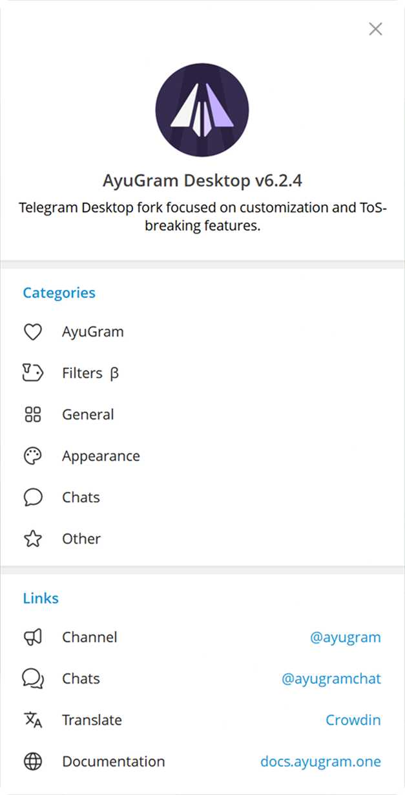
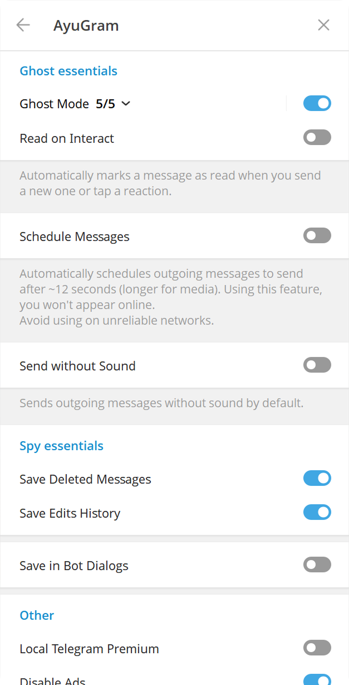
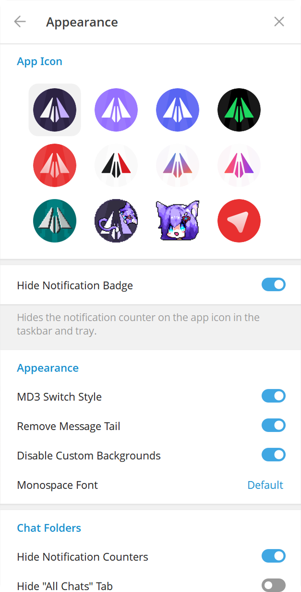
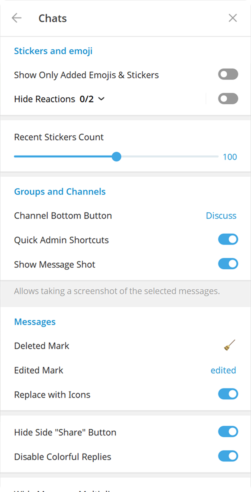

# AyuGram Flatpak

 

This is a fork of [AyuGramDesktop](https://github.com/AyuGram/AyuGramDesktop) designed for building and distributing Flatpak packages.

In this repository, you will find ready-to-use Flatpak builds on the [**Releases**](https://github.com/0FL01/AyuGramDesktop-flatpak/releases) page, as well as all the necessary files to build from source code yourself.

## Installation

### Method 1: Pre-built Package (Recommended)

1.  Go to the [**Releases**](https://github.com/0FL01/AyuGramDesktop-flatpak/releases) page of this repository.
2.  Download the latest `.flatpak` file from the "Assets" section.
3.  Open a terminal in the folder with the downloaded file and run the installation command:
    ```bash
    flatpak install ayugram-desktop-*.flatpak
    ```

### Method 2: Building from Source

To build the package from source code yourself, please follow the official guide:

[**Flatpak Building Guide**](https://github.com/0FL01/AyuGramDesktop-flatpak/blob/dev/docs/building-flatpak.md)

---

<details>
<summary><strong>Information about the original AyuGram project (click to expand)</strong></summary>

[ English | [Русский](https://github.com/AyuGram/AyuGramDesktop/blob/dev/README-RU.md) ]

## Features

- Full ghost mode (flexible)
- Messages history
- Anti-recall
- Font customization
- Streamer mode
- Local Telegram Premium
- Translator
- Media preview & quick reaction on force click (macOS)
- Enhanced appearance

And many more. Check out our [Documentation](https://docs.ayugram.one/desktop/).

<h3>
  <details>
    <summary>Preview</summary>
    <table>
      <tr>
        <td></td>
        <td></td>
        <td></td>
      </tr>
      <tr>
        <td></td>
        <td></td>
      </tr>
    </table>
  </details>
</h3>

## Downloads

### Windows

#### Official

You can download prebuilt Windows binary from [Releases tab](https://github.com/AyuGram/AyuGramDesktop/releases) or from
the [Telegram channel](https://t.me/AyuGramReleases).

#### Winget

```bash
winget install RadolynLabs.AyuGramDesktop
```

#### Scoop

```bash
scoop bucket add extras
scoop install ayugram
```

#### Self-built

Follow [official guide](https://github.com/AyuGram/AyuGramDesktop/blob/dev/docs/building-win-x64.md) if you want to
build by yourself.

### macOS

#### Official

You can download prebuilt macOS package from [Releases tab](https://github.com/AyuGram/AyuGramDesktop/releases).

#### Homebrew

```bash
brew install --cask ayugram
```

### Arch Linux

#### From source (recommended)

Install `ayugram-desktop` from [AUR](https://aur.archlinux.org/packages/ayugram-desktop).

#### Prebuilt binaries

Install `ayugram-desktop-bin` from [AUR](https://aur.archlinux.org/packages/ayugram-desktop-bin).

Note: these binaries aren't officially maintained by us.

### NixOS

See [this repository](https://github.com/ayugram-port/ayugram-desktop) for installation manual.

### ALT Linux

[Sisyphus](https://packages.altlinux.org/en/sisyphus/srpms/ayugram-desktop/)

### Gentoo Linux

See [this repository](https://github.com/OverLessArtem/ayugram-ebuild-gentoo) for installation manual.

### EPM

`epm play ayugram`

### Any other Linux distro

Flatpak: https://github.com/0FL01/AyuGramDesktop-flatpak

Or follow the [official guide](https://github.com/AyuGram/AyuGramDesktop/blob/dev/docs/building-linux.md).

### Remarks for Windows

Make sure you have these components installed with VS Build Tools:

- C++ MFC latest (x86 & x64)
- C++ ATL latest (x86 & x64)
- latest Windows 11 SDK

## Donation

Enjoy using **AyuGram**? Consider sending us a tip!

[Here's available methods.](https://docs.ayugram.one/donate/)

## Credits

### Telegram clients

- [Telegram Desktop](https://github.com/telegramdesktop/tdesktop)
- [Kotatogram](https://github.com/kotatogram/kotatogram-desktop)
- [64Gram](https://github.com/TDesktop-x64/tdesktop)
- [Forkgram](https://github.com/forkgram/tdesktop)

### Libraries used

- [JSON for Modern C++](https://github.com/nlohmann/json)
- [SQLite](https://github.com/sqlite/sqlite)
- [sqlite_orm](https://github.com/fnc12/sqlite_orm)
- [androidx sources](https://github.com/androidx/androidx)

### Icons

- [Solar Icon Set](https://www.figma.com/community/file/1166831539721848736)

### Bots

- [TelegramDB](https://t.me/tgdatabase) for username lookup by ID

</details>
